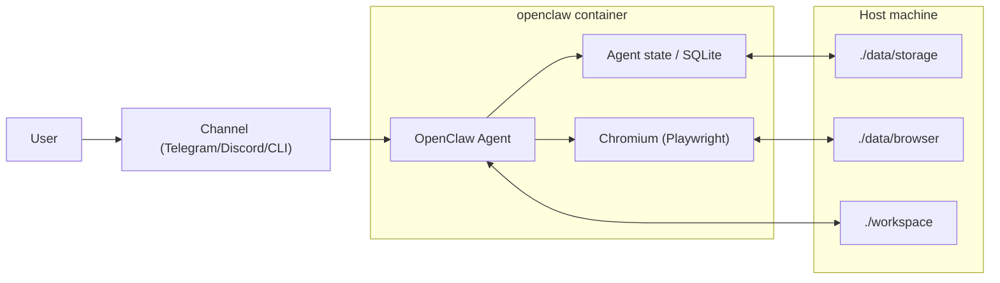
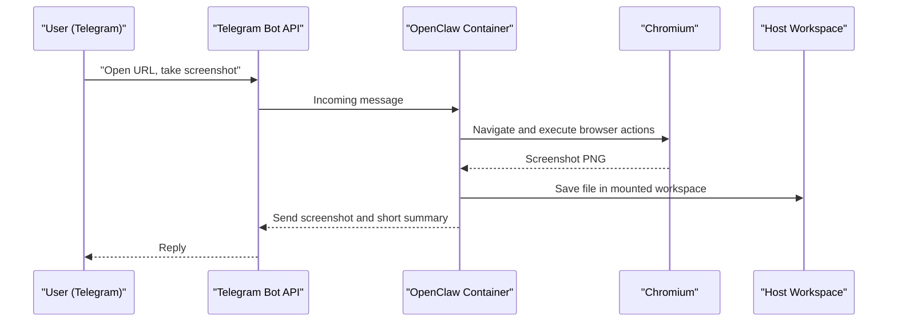

# OpenClaw Docker Sandbox

Turnkey, secure Docker sandbox for OpenClaw with persistent agent memory, persistent browser profile, and host-mounted workspace.

## Quick Start (Step-by-Step)

1. Pick one config profile:

- Remote API providers (default):

```bash
cp .env.example .env
```

- Local LM Studio server:

```bash
cp .env.lmstudio.local.example .env
```

2. Open `.env` and fill **mandatory** values at the top.

Remote profile (`.env.example`):

- `AI_PROVIDER` (`openai`, `anthropic`, or `google`)
- Exactly one matching API key:
  - `OPENAI_API_KEY` for `AI_PROVIDER=openai`
  - `ANTHROPIC_API_KEY` for `AI_PROVIDER=anthropic`
  - `GEMINI_API_KEY` for `AI_PROVIDER=google` (recommended)
  - `GOOGLE_GENERATIVE_AI_API_KEY` is also supported as a backward-compatible alias

LM Studio profile (`.env.lmstudio.local.example`):

- keep `AI_PROVIDER=openai`
- keep `OPENAI_BASE_URL=http://host.docker.internal:1234/v1`
- use `OPENAI_MODEL=openai/<id-from-/v1/models>` (for example `openai/google/gemma-3-12b`)
- keep `OPENAI_CUSTOM_MODEL_ENABLED=true`
- keep `OPENCLAW_SYNC_ENV_MODEL=true`

3. (Optional) Enable Telegram channel:

```dotenv
TELEGRAM_BOT_TOKEN=123456:ABCDEF...
TELEGRAM_ALLOWED_USER_IDS=123456789
```

4. If you are switching profile/mode, reset to zero state first:

```bash
./scripts/reset-state.sh --yes
```

5. Start with one command:

```bash
docker compose up --build
```

## One-Minute Telegram Test Case

Send this message to your bot after startup:

```text
Open https://example.com.
Take a screenshot and send it back in reply.
Also save the screenshot to /home/openclaw/.openclaw/workspace/screenshots/example.png
and briefly describe what is visible on the page.
```

Important:

- Send this message from your own Telegram account.
- A bot message sent by itself via `sendMessage` is not an inbound user trigger and will not start a run.

Verify local output:

```bash
ls -lah ./workspace/screenshots
```

## Quality Checks

Run baseline checks:

```bash
./tests/run-all.sh
```

Run with Docker integration checks:

```bash
WITH_DOCKER=1 ./tests/run-all.sh
```

`WITH_DOCKER=1` flow now includes dependency gate:
`pnpm audit --prod --audit-level high`.

Run reset-state flow check (destructive):

```bash
WITH_DOCKER=1 WITH_RESET_FLOW=1 ./tests/run-all.sh
```

## Memory Bank

Project context snapshot is stored in:

- `memory_bank/activeContext.md`
- `memory_bank/decisions.md`
- `memory_bank/errors.md`
- `memory_bank/glossary.md`
- `memory_bank/progress.md`
- `memory_bank/techContext.md`
- `memory_bank/requirements/main_logic.md`

## LM Studio Local Notes

- Host machine check:
  `curl http://localhost:1234/v1/models`
- Container check:
  `docker compose exec -T openclaw curl -sS http://host.docker.internal:1234/v1/models`
- Do not escape `/` in model names.
- For OpenClaw with `AI_PROVIDER=openai`, use:
  `OPENAI_MODEL=openai/<lm-studio-model-id>`
- Keep `OPENCLAW_SYNC_ENV_MODEL=true` in LM Studio mode to prevent stale
  `data/storage/openclaw.json` model values from overriding `.env`.

## Architecture Overview





## Mandatory vs Default Configuration

Both templates are split into:

- `MANDATORY`: must be filled before first launch
- `DEFAULTS`: validated defaults that are safe for first run

Templates:

- `.env.example` for normal remote provider auth (`OpenAI`/`Anthropic`/`Google`)
- `.env.lmstudio.local.example` for local LM Studio server (`OpenAI-compatible`)

### Minimal required startup variables

| Variable | Required to boot | Purpose |
|---|---|---|
| `AI_PROVIDER` | Yes | Selects provider (`openai`, `anthropic`, `google`) |
| `OPENAI_API_KEY` / `ANTHROPIC_API_KEY` / `GEMINI_API_KEY` | Yes (one, based on provider) | Auth for model access |
| `TELEGRAM_BOT_TOKEN` | No | Enables Telegram channel |
| `TELEGRAM_ALLOWED_USER_IDS` | No (strongly recommended) | Restricts who can use the bot |
| `CONFIRMATION_MODE` | No | Default is `full-auto` for task-first bot execution |
| `BROWSER_DEFAULT_PROFILE` | No | Keep `openclaw` in Docker mode |
| `BROWSER_NO_SANDBOX` | No | Usually `true` in Linux containers |
| `OPENCLAW_TMPDIR` | No | Runtime temp dir (default `/home/openclaw/.openclaw/tmp`) to avoid `/tmp` exhaustion |
| `OPENCLAW_GATEWAY_TOKEN` | No | Optional fixed gateway auth token to avoid runtime token rotation/races |
| `OPENCLAW_SYNC_ENV_MODEL` | No | If `true`, model in `.env` is enforced on each startup |
| `OPENAI_CUSTOM_MODEL_ENABLED` | No | Enables OpenAI-compatible custom model fallback (needed for LM Studio ids) |

## Persistent Data Mapping

| Host path | Container path | Purpose |
|---|---|---|
| `./data/storage` | `/home/openclaw/.openclaw` | Agent memory, config, SQLite, runtime state |
| `./data/browser` | `/home/openclaw/.openclaw/browser` | Browser sessions and login state |
| `./workspace` | `/home/openclaw/.openclaw/workspace` | Input/output files for tasks |

Data directories are excluded from git via `.gitignore` (`data/`, `.data/`, `workspace/`).

## Validated Versions (as of February 16, 2026)

- OpenClaw: `v2026.2.15`
- Node.js: `22.22.0` (Node 22 LTS)
- Playwright base image: `v1.58.2-noble`

## Included Runtime Compatibility Fixes

- Browser tool patch for OpenClaw `v2026.2.15`:
  - `action=screenshot` correctly handles `targetUrl` (open/navigate before capture)
  - optional `path` persists a local copy (for example `workspace/screenshots/...`)
  - `target=node` now falls back to local browser in single-container mode when no browser-capable nodes are connected
  - `url` is accepted as alias for `targetUrl` in browser tool calls
- Telegram delivery dedupe patch:
  - prevents duplicate screenshot sends when the same file arrives via multiple media paths in one reply flow
  - normalizes local `file://` URLs against plain local paths before dedupe
- Entrypoint cleanup for stale Chromium lock/socket files on startup:
  - avoids `Failed to start Chrome CDP on port 18800` after container recreate/restart
- Entrypoint runtime guardrails for bot channels:
  - if `CONFIRMATION_MODE=suggest` with Telegram/Discord enabled, startup forces `full-auto` by default
  - `workspace/BOOTSTRAP.md` is auto-disabled to prevent onboarding prompts from hijacking task execution
- Optional env-driven startup sync (disabled by default):
  - `OPENCLAW_SYNC_ENV_MODEL=true` enforces `.env` model on every boot
  - `OPENAI_CUSTOM_MODEL_ENABLED=true` writes `models.providers.openai` from `.env` for local OpenAI-compatible backends (LM Studio/Ollama/vLLM)

## Security Defaults

- Runs as non-root user `openclaw` (`UID 10001`, `GID 10001`)
- Uses `tini` as init process
- Uses `NODE_ENV=production` by default
- Applies volume permission fixups at startup
- Clears stale Chromium singleton lock/socket files at startup

## Troubleshooting

Show logs:

```bash
docker compose logs -f openclaw
```

Stop all services (keep data volumes and bind-mounted data):

```bash
docker compose down
```

Stop all services and remove compose-managed volumes/networks:

```bash
docker compose down --volumes --remove-orphans
```

Reset to zero state (recommended when switching model/provider mode):

```bash
./scripts/reset-state.sh --yes
```

Restart service:

```bash
docker compose restart openclaw
```

If Telegram replies are missing, confirm:

- `TELEGRAM_BOT_TOKEN` is valid
- your numeric user id is listed in `TELEGRAM_ALLOWED_USER_IDS`
- container logs do not show channel/auth errors

If screenshot/browser actions fail with `gateway closed (1008): unauthorized: device token mismatch`:

- keep a stable `OPENCLAW_GATEWAY_TOKEN` in `.env` (or leave it empty and restart once so entrypoint persists one)
- run `./scripts/reset-state.sh --yes`
- start fresh with `docker compose up -d --build`

If Telegram returns duplicate screenshots for one request:

- ensure latest patches are present (`0003` + `0009`)
- rebuild and restart: `docker compose up -d --build`
- rerun validation: `WITH_DOCKER=1 WITH_RESET_FLOW=1 ./tests/run-all.sh`

If the bot keeps chatting instead of executing actions (for example asks extra questions instead of taking a screenshot):

- ensure `CONFIRMATION_MODE=full-auto`
- keep `SANDBOX_FORCE_CHANNEL_FULL_AUTO=true`
- keep `SANDBOX_DISABLE_WORKSPACE_TEMPLATES=true`
- restart with `docker compose down && docker compose up -d --build`
- inspect disabled templates:
  `ls -lah ./data/storage/system/disabled-workspace-files`

If startup fails with `mkdir: cannot create directory '/home/openclaw': Permission denied`:

- ensure your `docker-compose.yml` does not include `cap_drop: [ALL]` for this service
- run `docker compose down && docker compose up -d --build` after pulling the latest repo changes

If container enters restart loop with `ENOSPC: no space left on device, mkdir '/tmp/openclaw-10001'`:

- keep `OPENCLAW_TMPDIR=/home/openclaw/.openclaw/tmp` (default in templates)
- keep `TMPDIR` mapped from `OPENCLAW_TMPDIR` (already set in `docker-compose.yml`)
- run `./scripts/reset-state.sh --yes`
- restart with `docker compose up -d --build`

## Cleanup

See `CLEANUP.md` for commands to wipe memory and browser profile data.

## Public Release Security Checklist

Run these checks before publishing:

```bash
# 0) Verify commit metadata does not leak personal email/name (optional policy)
git log --format='%h %an <%ae>'

# 1) Ensure no secrets are tracked
git ls-files | xargs -I{} sh -c "grep -nH -E '(AKIA[0-9A-Z]{16}|ghp_[A-Za-z0-9]{36}|xox[baprs]-[A-Za-z0-9-]{10,}|[0-9]{8,10}:[A-Za-z0-9_-]{30,}|AIza[0-9A-Za-z_-]{35})' '{}' || true"

# 2) Ensure history has no leaked secrets
git log -p --all | rg -n -e 'AKIA[0-9A-Z]{16}' -e 'ghp_[A-Za-z0-9]{36}' -e 'xox[baprs]-[A-Za-z0-9-]{10,}' -e '[0-9]{8,10}:[A-Za-z0-9_-]{30,}' -e 'AIza[0-9A-Za-z_-]{35}'

# 3) Confirm ignored sensitive/local data
git check-ignore -v .env data/storage workspace

# 4) Ensure ignored dirs are not already tracked
git ls-files | rg '^(data/|workspace/)'

# 5) Dependency vulnerability audit (inside container)
docker compose exec -T openclaw pnpm audit --prod --audit-level high
```

If any secret appears in history, rotate it immediately and rewrite git history before publishing.

If commit metadata includes personal email and you want to hide it, rewrite author metadata before release and force-push.

If `git ls-files` shows `data/` or `workspace/`, untrack them once:

```bash
git rm -r --cached data workspace
```
