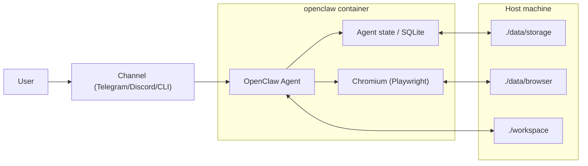
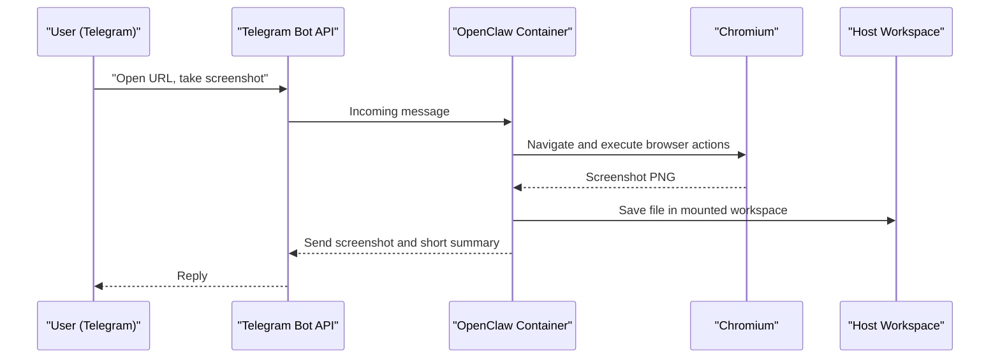

# OpenClaw Docker Sandbox

Turnkey, secure Docker sandbox for OpenClaw with persistent agent memory, persistent browser profile, and host-mounted workspace.

## Quick Start (Step-by-Step)

1. Copy the environment template:

```bash
cp .env.example .env
```

2. Open `.env` and fill **mandatory** values at the top:

- `AI_PROVIDER` (`openai`, `anthropic`, or `google`)
- Exactly one matching API key:
  - `OPENAI_API_KEY` for `AI_PROVIDER=openai`
  - `ANTHROPIC_API_KEY` for `AI_PROVIDER=anthropic`
  - `GEMINI_API_KEY` for `AI_PROVIDER=google` (recommended)
  - `GOOGLE_GENERATIVE_AI_API_KEY` is also supported as a backward-compatible alias

3. (Optional) Enable Telegram channel:

```dotenv
TELEGRAM_BOT_TOKEN=123456:ABCDEF...
TELEGRAM_ALLOWED_USER_IDS=123456789
```

4. Start with one command:

```bash
docker compose up --build
```

## One-Minute Telegram Test Case

Send this message to your bot after startup:

```text
Open https://example.com.
Take a screenshot and send it back in reply.
Also save the screenshot to /home/openclaw/.openclaw/workspace/screenshots/example.png
and briefly describe what is visible on the page.
```

Verify local output:

```bash
ls -lah ./workspace/screenshots
```

## Architecture Overview





## Mandatory vs Default Configuration

`.env.example` is split into:

- `MANDATORY`: must be filled before first launch
- `DEFAULTS`: validated defaults that are safe for first run

### Minimal required startup variables

| Variable | Required to boot | Purpose |
|---|---|---|
| `AI_PROVIDER` | Yes | Selects provider (`openai`, `anthropic`, `google`) |
| `OPENAI_API_KEY` / `ANTHROPIC_API_KEY` / `GEMINI_API_KEY` | Yes (one, based on provider) | Auth for model access |
| `TELEGRAM_BOT_TOKEN` | No | Enables Telegram channel |
| `TELEGRAM_ALLOWED_USER_IDS` | No (strongly recommended) | Restricts who can use the bot |
| `BROWSER_DEFAULT_PROFILE` | No | Keep `openclaw` in Docker mode |
| `BROWSER_NO_SANDBOX` | No | Usually `true` in Linux containers |

## Persistent Data Mapping

| Host path | Container path | Purpose |
|---|---|---|
| `./data/storage` | `/home/openclaw/.openclaw` | Agent memory, config, SQLite, runtime state |
| `./data/browser` | `/home/openclaw/.openclaw/browser` | Browser sessions and login state |
| `./workspace` | `/home/openclaw/.openclaw/workspace` | Input/output files for tasks |

Data directories are excluded from git via `.gitignore` (`data/`, `.data/`, `workspace/`).

## Validated Versions (as of February 16, 2026)

- OpenClaw: `v2026.2.15`
- Node.js: `22.22.0` (Node 22 LTS)
- Playwright base image: `v1.58.2-noble`

## Included Runtime Compatibility Fixes

- Browser tool patch for OpenClaw `v2026.2.15`:
  - `action=screenshot` correctly handles `targetUrl` (open/navigate before capture)
  - optional `path` persists a local copy (for example `workspace/screenshots/...`)
- Entrypoint cleanup for stale Chromium lock/socket files on startup:
  - avoids `Failed to start Chrome CDP on port 18800` after container recreate/restart

## Security Defaults

- Runs as non-root user `openclaw` (`UID 10001`, `GID 10001`)
- Uses `tini` as init process
- Uses `NODE_ENV=production` by default
- Applies volume permission fixups at startup
- Clears stale Chromium singleton lock/socket files at startup

## Troubleshooting

Show logs:

```bash
docker compose logs -f openclaw
```

Stop all services (keep data volumes and bind-mounted data):

```bash
docker compose down
```

Stop all services and remove compose-managed volumes/networks:

```bash
docker compose down --volumes --remove-orphans
```

Restart service:

```bash
docker compose restart openclaw
```

If Telegram replies are missing, confirm:

- `TELEGRAM_BOT_TOKEN` is valid
- your numeric user id is listed in `TELEGRAM_ALLOWED_USER_IDS`
- container logs do not show channel/auth errors

If startup fails with `mkdir: cannot create directory '/home/openclaw': Permission denied`:

- ensure your `docker-compose.yml` does not include `cap_drop: [ALL]` for this service
- run `docker compose down && docker compose up -d --build` after pulling the latest repo changes

## Cleanup

See `CLEANUP.md` for commands to wipe memory and browser profile data.

## Public Release Security Checklist

Run these checks before publishing:

```bash
# 1) Ensure no secrets are tracked
git ls-files | xargs -I{} sh -c "grep -nH -E '(AKIA[0-9A-Z]{16}|ghp_[A-Za-z0-9]{36}|xox[baprs]-[A-Za-z0-9-]{10,}|[0-9]{8,10}:[A-Za-z0-9_-]{30,}|AIza[0-9A-Za-z_-]{35})' '{}' || true"

# 2) Ensure history has no leaked secrets
git log -p --all | rg -n -e 'AKIA[0-9A-Z]{16}' -e 'ghp_[A-Za-z0-9]{36}' -e 'xox[baprs]-[A-Za-z0-9-]{10,}' -e '[0-9]{8,10}:[A-Za-z0-9_-]{30,}' -e 'AIza[0-9A-Za-z_-]{35}'

# 3) Confirm ignored sensitive/local data
git check-ignore -v .env data/storage workspace
```

If any secret appears in history, rotate it immediately and rewrite git history before publishing.
