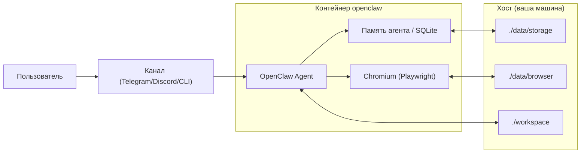
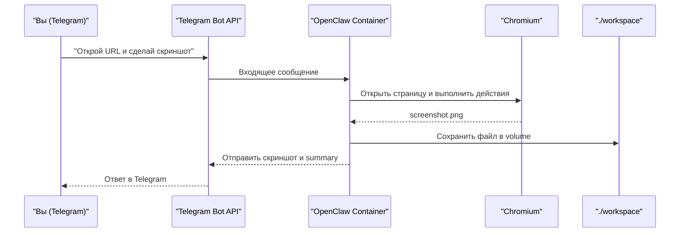

# OpenClaw Docker Sandbox

Наглядный и безопасный Docker-сендбокс для OpenClaw с постоянной памятью, браузерным профилем и рабочей папкой на хосте.

## Validated Versions (as of February 16, 2026)

- OpenClaw: `v2026.2.15`
- Node.js: `22.22.0` (Node 22 LTS)
- Playwright Docker base: `v1.58.2-noble`

## Как это работает



## Quick Start (3 шага)

1. Подготовьте `.env`:

```bash
cp .env.example .env
```

2. Укажите минимальные параметры в `.env`:

```dotenv
AI_PROVIDER=openai
OPENAI_API_KEY=your_api_key_here
```

Если хотите тест через Telegram, добавьте:

```dotenv
TELEGRAM_BOT_TOKEN=123456:ABCDEF...
TELEGRAM_ALLOWED_USER_IDS=123456789
```

3. Запустите всё одной командой:

```bash
docker compose up --build
```

## Минимальная конфигурация

| Параметр | Нужен для старта | Что делает |
|---|---|---|
| `AI_PROVIDER` | Да | Выбор провайдера (`openai`, `anthropic`, `google`) |
| `OPENAI_API_KEY` / `ANTHROPIC_API_KEY` / `GOOGLE_GENERATIVE_AI_API_KEY` | Да (один из) | Доступ к выбранной модели |
| `TELEGRAM_BOT_TOKEN` | Нет | Включает Telegram-канал |
| `TELEGRAM_ALLOWED_USER_IDS` | Нет (рекомендуется) | Ограничивает доступ к боту по user ID |

## Где лежат постоянные данные

| На хосте | В контейнере | Назначение |
|---|---|---|
| `./data/storage` | `/home/openclaw/.openclaw/storage` | Память агента, SQLite, состояние |
| `./data/browser` | `/home/openclaw/.openclaw/browser-profile` | Сессии/логины браузера |
| `./workspace` | `/home/openclaw/.openclaw/workspace` | Ваши файлы и результаты задач |

## RHYTHM Test-Case: Telegram -> Browser -> Screenshot

Идея: отправляете задачу в Telegram, OpenClaw открывает сайт в контейнерном Chromium, делает скриншот и возвращает результат.



### Шаги теста

1. Создайте бота в `@BotFather` и получите токен.
2. Впишите `TELEGRAM_BOT_TOKEN` (и желательно `TELEGRAM_ALLOWED_USER_IDS`) в `.env`.
3. Запустите `docker compose up --build`.
4. Отправьте боту это сообщение:

```text
Открой https://example.com.
Сделай скриншот страницы и пришли его в ответ.
Дополнительно сохрани скриншот в /home/openclaw/.openclaw/workspace/screenshots/example.png
и напиши коротко, что увидел на странице.
```

5. Проверьте, что файл появился локально:

```bash
ls -lah ./workspace/screenshots
```

Если бот не отвечает в DM, проверьте логи:

```bash
docker compose logs -f openclaw
```

## Security Defaults

- На старте entrypoint фиксит права на volume-папки, затем процесс работает от `openclaw` (`UID 10001`, `GID 10001`)
- `tini` используется как init-процесс
- `NODE_ENV=production` по умолчанию

## Cleanup

Команды очистки памяти и браузерного профиля: `CLEANUP.md`
